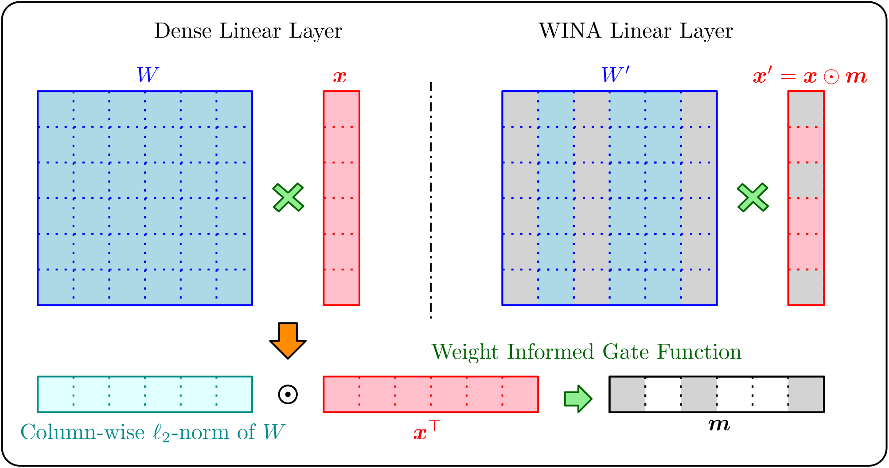

# WINA: Weight Informed Neuron Activation for Accelerating Large Language Model Inference

\[[paper](https://arxiv.org/abs/2505.19427)\]

<div  align="center">    

</div>

This repository is the Pytorch implementation of **WINA** (**W**eight **I**nformed **N**euron **A**ctivation). WINA is a novel, simple, and training-free sparse activation framework that jointly considers hidden state magnitudes and the column-wise ℓ2-norms of weight matrices. We show that this leads to a sparsification strategy that obtains optimal approximation error bounds with theoretical guarantees tighter than existing techniques. Empirically, WINA also outperforms state-of-the-art methods in average performance at the same sparsity levels, across a diverse set of LLM architectures and datasets. These results position WINA as a new performance frontier for training-free sparse activation in LLM inference, advancing training-free sparse activation methods and setting a robust baseline for efficient inference.

The current release supports:
* Llama-2-7B
* Llama-3-8B
* Qwen-2.5-7B
* Phi-4 (14B)

## Contents
- [Install](#Install)
- [Sparsity Allocation](#Sparsity-Allocation)
- [Evaluation](#Evaluation)
- [Reproduction](#Reproduction)

## Install

1. Clone the repo and navigate to wina:

```
git clone https://github.com/microsoft/wina.git
cd wina
```

2. Set up environment:

```bash
conda create -yn wina python=3.11
conda activate wina

pip install -r requirements.txt
```

## Sparsity Allocation
We assign sparsity for each weight matrices instead of a uniform sparsity across the model through the greedy algorithm proposed in TEAL.

💡Note: If you want to assign uniform sparsity for all matrices, you can **skip this part**.

1. Construct hidden states histograms. 
```bash
python wina/grab_acts.py --model_name [MODEL_PATH] --output_path [OUTPUT_PATH] --sparse_mode [SPARSE_MODE] --transform(Optional)
```
2. Allocate sparsity
```bash
python wina/greedyopt.py --model_name [MODEL_PATH] --output_path [OUTPUT_PATH] --sparse_mode [SPARSE_MODE] --model_type [MODEL_TYPE] --transform(Optional)
```
💡Notes: The '--transform' flag enables tensor transformation. Simply omit this flag if you wish to skip the transformation process.

ℹ️ Arguments
* [MODEL_PATH]: Path to base model, can be remote path or local path
* [OUTPUT_PATH]: Path to save outputs, including hidden states histograms and sparsity allocation results.
* [SPARSE_MODE]: Can be **WINA** or **TEAL**
* [MODEL_TYPE]: Can be one of the following four:
    * Llama-3-8B
    * Llama-2-7B
    * Qwen-2.5-7B
    * Phi-4-14B

## Evaluation
```bash
python eval.py --base_model [MODEL_PATH] --save_path [OUTPUT_PATH] --sparsity [sparsity] --sparse_mode [SPARSE_MODE] --greedy
```
💡Notes: The --greedy flag enables per-matrix sparsity assignment. Ensure [Sparsity Allocation](#sparsity-allocation) is completed before using this option.

## Reproduction
### Dense model

```bash
bash scripts/baseline/qwen-2.5-7b.bash [MODEL_PATH]
bash scripts/baseline/llama-2-7b.bash [MODEL_PATH]
bash scripts/baseline/llama-3-8b.bash [MODEL_PATH]
bash scripts/baseline/phi_4_14b.bash [MODEL_PATH]
```

### WINA Sparsification

```bash
bash scripts/wina/qwen_2.5_7b.bash [MODEL_PATH]
bash scripts/wina/llama_2_7b.bash [MODEL_PATH]
bash scripts/wina/llama_3_8b.bash [MODEL_PATH]
bash scripts/wina/phi_4_14b.bash [MODEL_PATH]
```

### TEAL Sparsification
```bash
bash scripts/teal/qwen_2.5_7b.bash [MODEL_PATH]
bash scripts/teal/llama_2_7b.bash [MODEL_PATH]
bash scripts/teal/llama_3_8b.bash [MODEL_PATH]
bash scripts/teal/phi_4_14b.bash [MODEL_PATH]
```

### TEAL-transform Sparsification

```bash
bash scripts/teal_transform/qwen_2.5_7b.bash [MODEL_PATH]
bash scripts/teal_transform/llama_2_7b.bash [MODEL_PATH]
bash scripts/teal_transform/llama_3_8b.bash [MODEL_PATH]
bash scripts/teal_transform/phi_4_14b.bash [MODEL_PATH]
```

## Citation
If you find this repo useful, please consider citing:
```
@misc{chen2025winaweightinformedneuron,
      title={WINA: Weight Informed Neuron Activation for Accelerating Large Language Model Inference}, 
      author={Sihan Chen and Dan Zhao and Jongwoo Ko and Colby Banbury and Huiping Zhuang and Luming Liang and Tianyi Chen},
      year={2025},
      eprint={2505.19427},
      archivePrefix={arXiv},
      primaryClass={cs.LG},
      url={https://arxiv.org/abs/2505.19427}, 
}
```